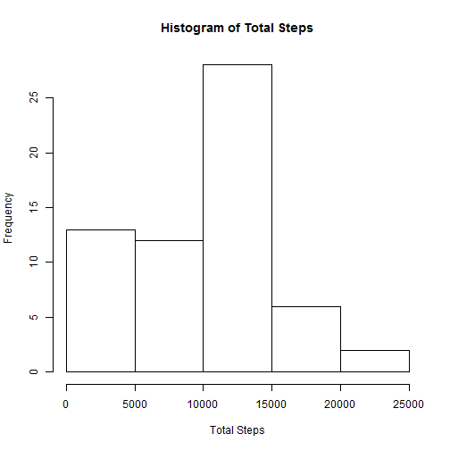
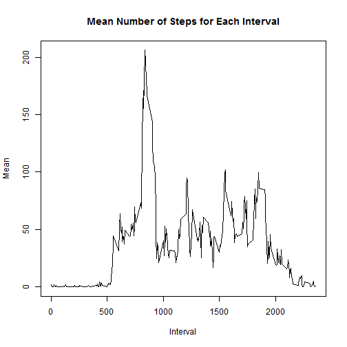
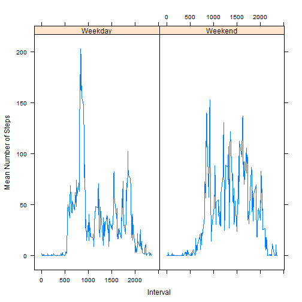

###Loading and preprocessing the data

Read in the .csv file for the dataset and make sure date is set as.Date

```r
setwd("E:/Users/Paul/Desktop/Reproducible research/Course Project 1/repdata_data_activity/")
data<-read.csv("activity.csv")
data$date <-as.Date(data$date)
```

###What is mean total number of steps taken per day?

Histogram of the total number of steps taken each day. Load the plyr package to use ddply.

```r
library(plyr)
tot.steps<-ddply(data, .(date), summarise, total=sum(steps, na.rm=TRUE))
hist(tot.steps$total, main="Histogram of Total Steps", xlab="Total Steps")
```

 

Mean and median number of steps each day.

```r
ddply(data, .(date), summarise, mean=mean(steps, na.rm=TRUE))
```

```
##          date    mean
## 1  2012-10-01     NaN
## 2  2012-10-02  0.4375
## 3  2012-10-03 39.4167
## 4  2012-10-04 42.0694
## 5  2012-10-05 46.1597
## 6  2012-10-06 53.5417
## 7  2012-10-07 38.2465
## 8  2012-10-08     NaN
## 9  2012-10-09 44.4826
## 10 2012-10-10 34.3750
## 11 2012-10-11 35.7778
## 12 2012-10-12 60.3542
## 13 2012-10-13 43.1458
## 14 2012-10-14 52.4236
## 15 2012-10-15 35.2049
## 16 2012-10-16 52.3750
## 17 2012-10-17 46.7083
## 18 2012-10-18 34.9167
## 19 2012-10-19 41.0729
## 20 2012-10-20 36.0938
## 21 2012-10-21 30.6285
## 22 2012-10-22 46.7361
## 23 2012-10-23 30.9653
## 24 2012-10-24 29.0104
## 25 2012-10-25  8.6528
## 26 2012-10-26 23.5347
## 27 2012-10-27 35.1354
## 28 2012-10-28 39.7847
## 29 2012-10-29 17.4236
## 30 2012-10-30 34.0938
## 31 2012-10-31 53.5208
## 32 2012-11-01     NaN
## 33 2012-11-02 36.8056
## 34 2012-11-03 36.7049
## 35 2012-11-04     NaN
## 36 2012-11-05 36.2465
## 37 2012-11-06 28.9375
## 38 2012-11-07 44.7326
## 39 2012-11-08 11.1771
## 40 2012-11-09     NaN
## 41 2012-11-10     NaN
## 42 2012-11-11 43.7778
## 43 2012-11-12 37.3785
## 44 2012-11-13 25.4722
## 45 2012-11-14     NaN
## 46 2012-11-15  0.1424
## 47 2012-11-16 18.8924
## 48 2012-11-17 49.7882
## 49 2012-11-18 52.4653
## 50 2012-11-19 30.6979
## 51 2012-11-20 15.5278
## 52 2012-11-21 44.3993
## 53 2012-11-22 70.9271
## 54 2012-11-23 73.5903
## 55 2012-11-24 50.2708
## 56 2012-11-25 41.0903
## 57 2012-11-26 38.7569
## 58 2012-11-27 47.3819
## 59 2012-11-28 35.3576
## 60 2012-11-29 24.4688
## 61 2012-11-30     NaN
```

```r
ddply(data, .(date), summarise, median=median(steps, na.rm=TRUE))
```

```
##          date median
## 1  2012-10-01     NA
## 2  2012-10-02      0
## 3  2012-10-03      0
## 4  2012-10-04      0
## 5  2012-10-05      0
## 6  2012-10-06      0
## 7  2012-10-07      0
## 8  2012-10-08     NA
## 9  2012-10-09      0
## 10 2012-10-10      0
## 11 2012-10-11      0
## 12 2012-10-12      0
## 13 2012-10-13      0
## 14 2012-10-14      0
## 15 2012-10-15      0
## 16 2012-10-16      0
## 17 2012-10-17      0
## 18 2012-10-18      0
## 19 2012-10-19      0
## 20 2012-10-20      0
## 21 2012-10-21      0
## 22 2012-10-22      0
## 23 2012-10-23      0
## 24 2012-10-24      0
## 25 2012-10-25      0
## 26 2012-10-26      0
## 27 2012-10-27      0
## 28 2012-10-28      0
## 29 2012-10-29      0
## 30 2012-10-30      0
## 31 2012-10-31      0
## 32 2012-11-01     NA
## 33 2012-11-02      0
## 34 2012-11-03      0
## 35 2012-11-04     NA
## 36 2012-11-05      0
## 37 2012-11-06      0
## 38 2012-11-07      0
## 39 2012-11-08      0
## 40 2012-11-09     NA
## 41 2012-11-10     NA
## 42 2012-11-11      0
## 43 2012-11-12      0
## 44 2012-11-13      0
## 45 2012-11-14     NA
## 46 2012-11-15      0
## 47 2012-11-16      0
## 48 2012-11-17      0
## 49 2012-11-18      0
## 50 2012-11-19      0
## 51 2012-11-20      0
## 52 2012-11-21      0
## 53 2012-11-22      0
## 54 2012-11-23      0
## 55 2012-11-24      0
## 56 2012-11-25      0
## 57 2012-11-26      0
## 58 2012-11-27      0
## 59 2012-11-28      0
## 60 2012-11-29      0
## 61 2012-11-30     NA
```

###What is the average daily activity pattern?

Daily activity pattern. 

```r
inter<-ddply(data, .(interval), summarise, mean=mean(steps, na.rm=TRUE))
plot(inter$interval, inter$mean, type="l", main="Mean Number of Steps for Each Interval", ylab="Mean", xlab="Interval")
```

 

Interval with the average max number of steps

```r
inter[which.max(inter$mean),1]
```

```
## [1] 835
```

###Inputting missing values

Calculation of the total number of values missing from the data

```r
data2<-data[!is.na(data$steps),]
nrow(data)-nrow(data2)
```

```
## [1] 2304
```
Creating new dataset with the missing values filled. I used 0 because it was the median for every day.

```r
data.nona<-data
data.nona$steps[is.na(data.nona$steps)]<-0
```
Recreating the histogram with missing values filled

```r
tot.steps.nn<-ddply(data.nona, .(date), summarise, total=sum(steps, na.rm=TRUE))
hist(tot.steps.nn$total, main="Histogram of Total Steps", xlab="Total Steps")
```

 

Recalculate the mean and median for each day and compare to orginal with NAs removed

```r
means_old<-ddply(data, .(date), summarise, mean=mean(steps, na.rm=TRUE))
medians_old<-ddply(data, .(date), summarise, median=median(steps, na.rm=TRUE))
means_nn<-ddply(data.nona, .(date), summarise, mean=mean(steps, na.rm=TRUE))
medians_nn<-ddply(data.nona, .(date), summarise, median=median(steps, na.rm=TRUE))
means_nn<-cbind(means_nn, means_old[,2])
colnames(means_nn)<-c("date", "mean", "old mean")
medians_nn<-cbind(medians_nn, medians_old[,2])
colnames(medians_nn)<-c("date", "median", "old median")
means_nn
```

```
##          date    mean old mean
## 1  2012-10-01  0.0000      NaN
## 2  2012-10-02  0.4375   0.4375
## 3  2012-10-03 39.4167  39.4167
## 4  2012-10-04 42.0694  42.0694
## 5  2012-10-05 46.1597  46.1597
## 6  2012-10-06 53.5417  53.5417
## 7  2012-10-07 38.2465  38.2465
## 8  2012-10-08  0.0000      NaN
## 9  2012-10-09 44.4826  44.4826
## 10 2012-10-10 34.3750  34.3750
## 11 2012-10-11 35.7778  35.7778
## 12 2012-10-12 60.3542  60.3542
## 13 2012-10-13 43.1458  43.1458
## 14 2012-10-14 52.4236  52.4236
## 15 2012-10-15 35.2049  35.2049
## 16 2012-10-16 52.3750  52.3750
## 17 2012-10-17 46.7083  46.7083
## 18 2012-10-18 34.9167  34.9167
## 19 2012-10-19 41.0729  41.0729
## 20 2012-10-20 36.0938  36.0938
## 21 2012-10-21 30.6285  30.6285
## 22 2012-10-22 46.7361  46.7361
## 23 2012-10-23 30.9653  30.9653
## 24 2012-10-24 29.0104  29.0104
## 25 2012-10-25  8.6528   8.6528
## 26 2012-10-26 23.5347  23.5347
## 27 2012-10-27 35.1354  35.1354
## 28 2012-10-28 39.7847  39.7847
## 29 2012-10-29 17.4236  17.4236
## 30 2012-10-30 34.0938  34.0938
## 31 2012-10-31 53.5208  53.5208
## 32 2012-11-01  0.0000      NaN
## 33 2012-11-02 36.8056  36.8056
## 34 2012-11-03 36.7049  36.7049
## 35 2012-11-04  0.0000      NaN
## 36 2012-11-05 36.2465  36.2465
## 37 2012-11-06 28.9375  28.9375
## 38 2012-11-07 44.7326  44.7326
## 39 2012-11-08 11.1771  11.1771
## 40 2012-11-09  0.0000      NaN
## 41 2012-11-10  0.0000      NaN
## 42 2012-11-11 43.7778  43.7778
## 43 2012-11-12 37.3785  37.3785
## 44 2012-11-13 25.4722  25.4722
## 45 2012-11-14  0.0000      NaN
## 46 2012-11-15  0.1424   0.1424
## 47 2012-11-16 18.8924  18.8924
## 48 2012-11-17 49.7882  49.7882
## 49 2012-11-18 52.4653  52.4653
## 50 2012-11-19 30.6979  30.6979
## 51 2012-11-20 15.5278  15.5278
## 52 2012-11-21 44.3993  44.3993
## 53 2012-11-22 70.9271  70.9271
## 54 2012-11-23 73.5903  73.5903
## 55 2012-11-24 50.2708  50.2708
## 56 2012-11-25 41.0903  41.0903
## 57 2012-11-26 38.7569  38.7569
## 58 2012-11-27 47.3819  47.3819
## 59 2012-11-28 35.3576  35.3576
## 60 2012-11-29 24.4688  24.4688
## 61 2012-11-30  0.0000      NaN
```

```r
medians_nn
```

```
##          date median old median
## 1  2012-10-01      0         NA
## 2  2012-10-02      0          0
## 3  2012-10-03      0          0
## 4  2012-10-04      0          0
## 5  2012-10-05      0          0
## 6  2012-10-06      0          0
## 7  2012-10-07      0          0
## 8  2012-10-08      0         NA
## 9  2012-10-09      0          0
## 10 2012-10-10      0          0
## 11 2012-10-11      0          0
## 12 2012-10-12      0          0
## 13 2012-10-13      0          0
## 14 2012-10-14      0          0
## 15 2012-10-15      0          0
## 16 2012-10-16      0          0
## 17 2012-10-17      0          0
## 18 2012-10-18      0          0
## 19 2012-10-19      0          0
## 20 2012-10-20      0          0
## 21 2012-10-21      0          0
## 22 2012-10-22      0          0
## 23 2012-10-23      0          0
## 24 2012-10-24      0          0
## 25 2012-10-25      0          0
## 26 2012-10-26      0          0
## 27 2012-10-27      0          0
## 28 2012-10-28      0          0
## 29 2012-10-29      0          0
## 30 2012-10-30      0          0
## 31 2012-10-31      0          0
## 32 2012-11-01      0         NA
## 33 2012-11-02      0          0
## 34 2012-11-03      0          0
## 35 2012-11-04      0         NA
## 36 2012-11-05      0          0
## 37 2012-11-06      0          0
## 38 2012-11-07      0          0
## 39 2012-11-08      0          0
## 40 2012-11-09      0         NA
## 41 2012-11-10      0         NA
## 42 2012-11-11      0          0
## 43 2012-11-12      0          0
## 44 2012-11-13      0          0
## 45 2012-11-14      0         NA
## 46 2012-11-15      0          0
## 47 2012-11-16      0          0
## 48 2012-11-17      0          0
## 49 2012-11-18      0          0
## 50 2012-11-19      0          0
## 51 2012-11-20      0          0
## 52 2012-11-21      0          0
## 53 2012-11-22      0          0
## 54 2012-11-23      0          0
## 55 2012-11-24      0          0
## 56 2012-11-25      0          0
## 57 2012-11-26      0          0
## 58 2012-11-27      0          0
## 59 2012-11-28      0          0
## 60 2012-11-29      0          0
## 61 2012-11-30      0         NA
```
***Making all NAs equal to zero made some of the dates that previously had no data have mean and median of 0***

###Are there differences in activity patterns between weekdays and weekends?

First create a new column with the day of the week.

```r
data.nona$day<-weekdays(data$date)
```
Change each to a weekday or weekend

```r
data.nona$day<-gsub("Monday","Weekday", data.nona$day)
data.nona$day<-gsub("Tuesday","Weekday", data.nona$day)
data.nona$day<-gsub("Wednesday","Weekday", data.nona$day)
data.nona$day<-gsub("Thursday","Weekday", data.nona$day)
data.nona$day<-gsub("Friday","Weekday", data.nona$day)
data.nona$day<-gsub("Saturday","Weekend", data.nona$day)
data.nona$day<-gsub("Sunday","Weekend", data.nona$day)
```
Load lattice and create the panel plot that compares weekdays and weekends

```r
library(lattice)
inter.nona<-ddply(data.nona, .(interval, day), summarise, mean=mean(steps, na.rm=TRUE))
xyplot(mean ~ interval|day, data=inter.nona, type="l", xlab="Interval", ylab="Mean Number of Steps")
```

 
